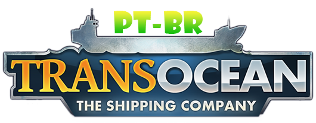

[](https://github.com/JUNIORGBJ)

## Baixar
[](https://github.com/JUNIORGBJ/TransOcean_PT-BR/releases/latest)

<h1 align="center"><figure>
  
</figure></h1>


## Sobre a Tradução

O objetivo do projeto é:

_ "Traduzir 100% do jogo com a melhor qualidade possível" _

## Por quê?

Este projeto irá ajudar muitas pessoas a entender melhor a história do jogo, portanto ficarei feliz se você puder ajudar de alguma forma o projeto, tradução, erros ortográficos e revisão em jogo!

### Instalação Manual

Será preciso colar e substituir as pastas ```Languages```no caminho especificado abaixo:

```TransOcean - The Shipping Company\TransOcean_Data```

## Ferramentas Ultilizadas

:link: [Visual Studio Code](https://code.visualstudio.com)
:link: [Inno Setup](https://jrsoftware.org/isinfo.php)

## Doações

[](https://picpay.me/gilsongbj)

Obrigado!:wave:
